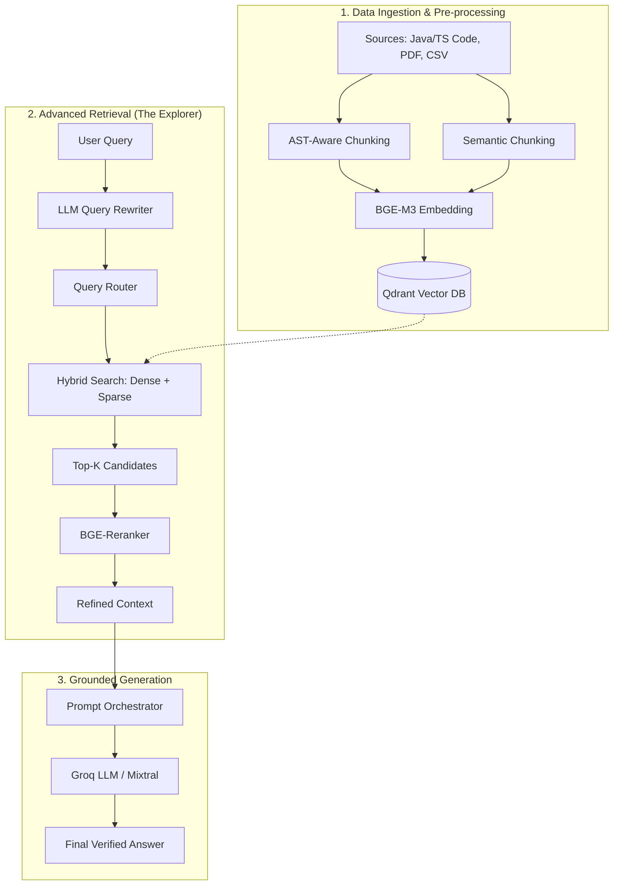

# Advanced RAG Architecture: QA Copilot

This document provides a detailed breakdown of the RAG (Retrieval-Augmented Generation) architecture used in the QA Copilot project. The system is designed for high-precision retrieval across diverse QA artifacts like automation code, test cases, and technical documentation.

## 1. System Architecture Diagram

The following diagram illustrates the flow from data ingestion to the final LLM response generation.

## 2. The Retrieval Pipeline (Step-by-Step)

The "RAG Explorer" debugger visualizes this specific pipeline:

1.  **Query Rewriting:** The raw user query is rewritten into a standalone search term, incorporating conversation history to maintain context.
2.  **Intelligent Routing:** The system decides which "Expert Collections" to search (e.g., searching only "Test Cases" if the user asks about manual testing).
3.  **Hybrid Search (Dense + Sparse):**
    *   **Dense (Vector):** Captures semantic meaning (BGE-M3).
    *   **Sparse (Keyword):** Captures exact technical terms, method names, or Jira IDs (BM25-style).
4.  **RRF Fusion:** Results from dense and sparse searches are combined using Reciprocal Rank Fusion (RRF).
5.  **BGE Reranking:** A cross-encoder model re-evaluates the relevance of the top 20 chunks against the query to ensure the most relevant context is at the top.

## 3. Core Components Breakdown

| Component | Technology | Purpose |
| :--- | :--- | :--- |
| **Vector Database** | Qdrant | Stores both dense and sparse embeddings with sub-millisecond search performance. |
| **Embeddings** | BGE-M3 | A multi-lingual, multi-modal embedding model capable of handling long-form text and code. |
| **Reranker** | BGE-Reranker-v2 | A cross-encoder used to filter out noise and prioritize high-signal chunks. |
| **Orchestration** | FastAPI | High-performance backend handling SSE streaming and async task management. |
| **LLM Inference** | Groq (Llama 3 / Mixtral) | Ultra-fast inference engine for query rewriting and final answer generation. |
| **Chunking Engine** | Custom AST-Aware | Specialized logic to split code by functions/classes and PDFs by semantic headers. |

## 4. The RAG Explorer (Debugger)

The RAG Explorer is a specialized UI component designed for developers to "look under the hood". It provides:
- **Traceability:** See exactly which chunks were retrieved and from which collection.
- **Scoring:** View the raw similarity scores before and after reranking.
- **Reasoning:** Understand why the LLM prioritized certain information over others.
